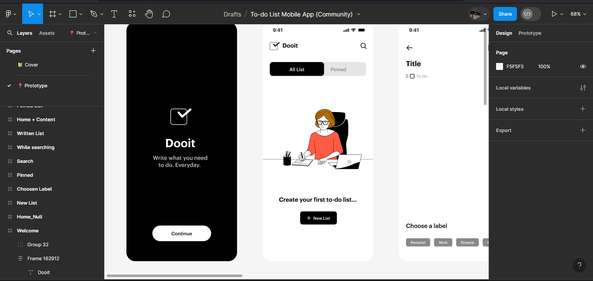

# Bienvenidos a Doot

Esta es una aplicacion movil creada en ReactNative y ExpoGo



## Explicacion 

La idea es que sea un proyecto de codigo abierto donde la gente podra apoyar con ideas, bugs, etc...

## Inicia el proyecto!!! 👨🏽‍💻

1. Instala Dependencias

   ```bash
   npm install
   ```

2. Inicia la aplicacion

   ```bash
    npx expo start
   ```

## Como colaborar 😊

### Requisitos:
 - Tener ganas de apoyer el proyecto
 - Conocer sobre ReactNative
 - PullRequest solamente y explicaciones sobre lo que haces (no se aceptan cambios no comentados)

## ¿Por que este proyecto?

La idea es poder aprender por mi parte, si deseas hacer lo mismo entra y apoyame, aunque si esto no se apoya no importa, tambien pueden aprender el como lo hago viendolo en Git Hub
